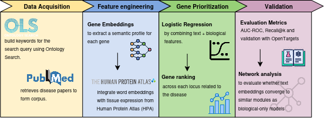
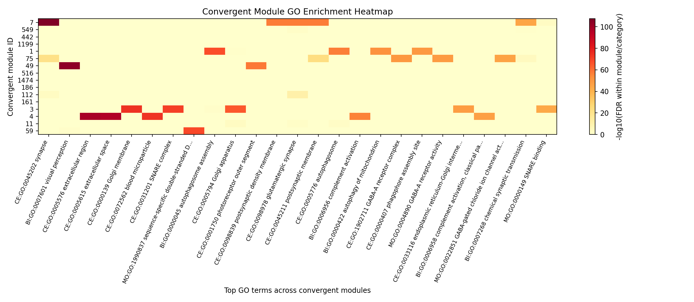
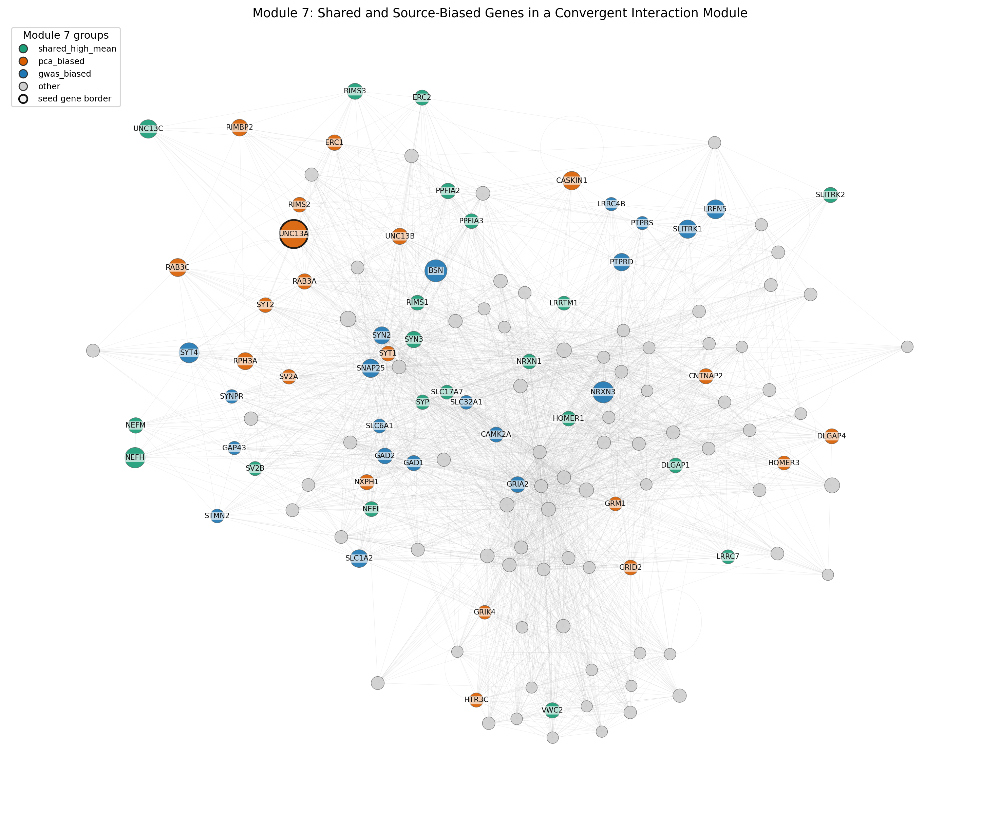

# ALS Gene Prioritization with Literature Embeddings and Network Analysis

This repository contains code developed for a research project on gene prioritization in Amyotrophic Lateral Sclerosis (ALS). The project investigates whether literature-derived gene representations can provide useful biological context for interpreting GWAS-associated loci and protein interaction modules.

## Overview

The pipeline combines:

- disease-focused PubMed corpora;
- gene-level Word2Vec embeddings;
- Human Protein Atlas brain and muscle expression features;
- logistic-regression models for gene prioritization;
- GWAS-derived evidence from ALS loci;
- protein interaction network propagation;
- module-level and Gene Ontology enrichment analyses.

The main goal is not only to rank candidate genes within GWAS loci, but also to evaluate whether text-derived functional signals converge with GWAS evidence at the level of biological modules.

  

## Main analyses

The project includes:

1. construction of neurodegenerative disease literature corpora;
2. training of Word2Vec gene embeddings;
3. PCA reduction and interpretation of the embedding space;
4. locus-level gene prioritization with logistic regression;
5. comparison between Word2Vec/HPA functional scores and GWAS-derived evidence;
6. Personalized PageRank propagation on a protein interaction network;
7. GO enrichment analysis of convergent modules;
8. module-level case study of shared and source-biased genes.

  

  

## Main idea

The project started from the hypothesis that biomedical literature embeddings could improve ALS locus-to-gene prioritization. While embeddings did not consistently improve locus-level ranking, the Word2Vec embedding space showed biologically interpretable structure. In network analyses, the Word2Vec/HPA functional model showed convergence with GWAS-derived evidence at the protein-module level.

The module-level analysis further suggested that literature-derived and GWAS-derived signals may highlight overlapping regions of the protein interaction network while emphasizing different genes within the same biological context.

## Notes

This repository is research-oriented and under active development. Scripts were written to support exploratory analyses during the BEPE/FAPESP research internship at ETH Zürich.
